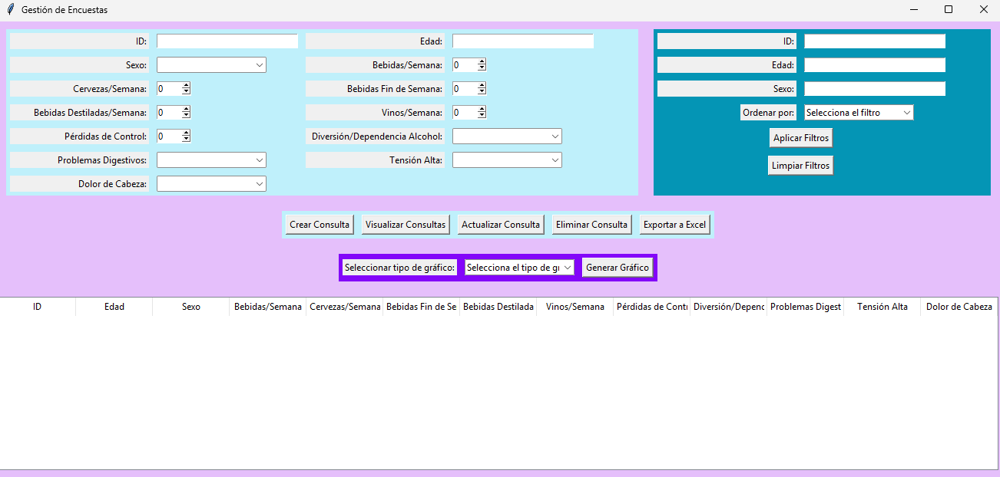

# Gestion de Consulta
Este proyecto es una aplicación de escritorio para la gestión de encuestas utilizando Python, Tkinter y MySQL. 
Permite realizar operaciones CRUD (Crear, Leer, Actualizar, Eliminar) sobre los registros de encuestas y visualizar gráficos

# 🎬Preview


# 💻Usage


1. Instalar Paquetes de Python: Abre la terminal o el símbolo del sistema y ejecuta los siguientes comandos:
	```
   pip install mysql-connector-python pandas openpyxl
	```
 
 2. Instalar TKinter:
```
   sudo apt-get install python3-tk
```

   **Conectar la Aplicación con MySQL**
   
   Crea una base de datos llamada encuestas:
   ```
     CREATE DATABASE encuestas;
     USE encuestas;

      CREATE TABLE ENCUESTA (
          idEncuesta INT AUTO_INCREMENT PRIMARY KEY,
          edad INT,
          Sexo VARCHAR(10),
          BebidasSemana INT,
          CervezasSemana INT,
          BebidasFinSemana INT,
          BebidasDestiladasSemana INT,
          VinosSemana INT,
          PerdidasControl VARCHAR(3),
          DiversionDependenciaAlcohol VARCHAR(3),
          ProblemasDigestivos VARCHAR(3),
          TensionAlta VARCHAR(3),
          DolorCabeza VARCHAR(20)
      );
    ```

   **Crear función de conexion en Python**
    
   ```python
   import mysql.connector

   def conectar_bd():
       return mysql.connector.connect(
           host="localhost",
           user="tu_usuario",
           password="tu_contraseña",
           database="encuestas"
       )
   ```

## Ejecutar el Programa

1. Clona o descarga este repositorio en tu máquina local.
2. Navega al directorio del proyecto en la terminal.
3. Ejecuta el programa con el siguiente comando:

   ```bash
   python nombre_del_archivo.py
   ```

   Asegúrate de reemplazar `nombre_del_archivo.py` con el nombre real del archivo que contiene el código.

**Operaciones CRUD**
   Una vez que la aplicación esté en ejecución, puedes realizar las siguientes operaciones:

- Crear Consulta: Completa los campos en el formulario y haz clic en "Crear Consulta" para agregar un nuevo registro.
  
- Visualizar Consultas: Haz clic en "Visualizar Consultas" para cargar todos los registros en la tabla.
  
- Actualizar Consulta: Selecciona un registro en la tabla, edita los campos en el formulario y haz clic en "Actualizar Consulta".
  
- Eliminar Consulta: Selecciona un registro en la tabla y haz clic en "Eliminar Consulta" para eliminarlo.

## Filtros

La aplicación permite aplicar filtros para buscar y visualizar encuestas específicas según ciertos criterios. A continuación, se describen los pasos para utilizar los filtros:

### Implementación de Filtros

1. **Agregar Campos de Filtro**: En la interfaz de usuario, se pueden agregar campos de entrada para los criterios de filtrado, como `edad`, `Sexo`, `ID`, etc. Asegúrate de que estos campos estén disponibles en el formulario.

2. **Modificar la Consulta SQL**: Cuando se aplica un filtro, debes modificar la consulta SQL que se utiliza para recuperar los datos de la base de datos. Por ejemplo:

   ```python
   def filtrar_encuestas(edad=None, sexo=None):
       conexion = conectar_bd()
       cursor = conexion.cursor()
       query = "SELECT * FROM ENCUESTA WHERE 1=1"
       params = []

       if edad is not None:
           query += " AND edad = %s"
           params.append(edad)
       if sexo is not None:
           query += " AND Sexo = %s"
           params.append(sexo)

       cursor.execute(query, params)
       resultados = cursor.fetchall()
       cursor.close()
       conexion.close()
       return resultados
**Uso de Filtros**
- Seleccionar Criterios de Filtro: En la interfaz de usuario, ingresa los criterios que deseas utilizar para filtrar las encuestas. Por ejemplo, puedes ingresar una edad específica o seleccionar un sexo.

- Aplicar Filtros: Haz clic en el botón "Aplicar Filtros" para ejecutar la búsqueda. La aplicación mostrará solo las encuestas que coincidan con los criterios especificados.

- Limpiar Filtros: Si deseas ver todas las encuestas nuevamente, puedes hacer clic en el botón "Limpiar Filtros", que restablecerá los campos de entrada y mostrará todos los registros.
- 
**Vizualizar Graficos**
- Selecciona el tipo de gráfico que deseas generar (Barras, Pastel, Líneas) en el menú desplegable.

- Haz clic en "Generar Gráfico" para visualizar el gráfico correspondiente basado en los datos de la tabla

## Licencia

Este proyecto está bajo la Licencia MIT. Consulta el archivo LICENSE para más información.
``` ```
